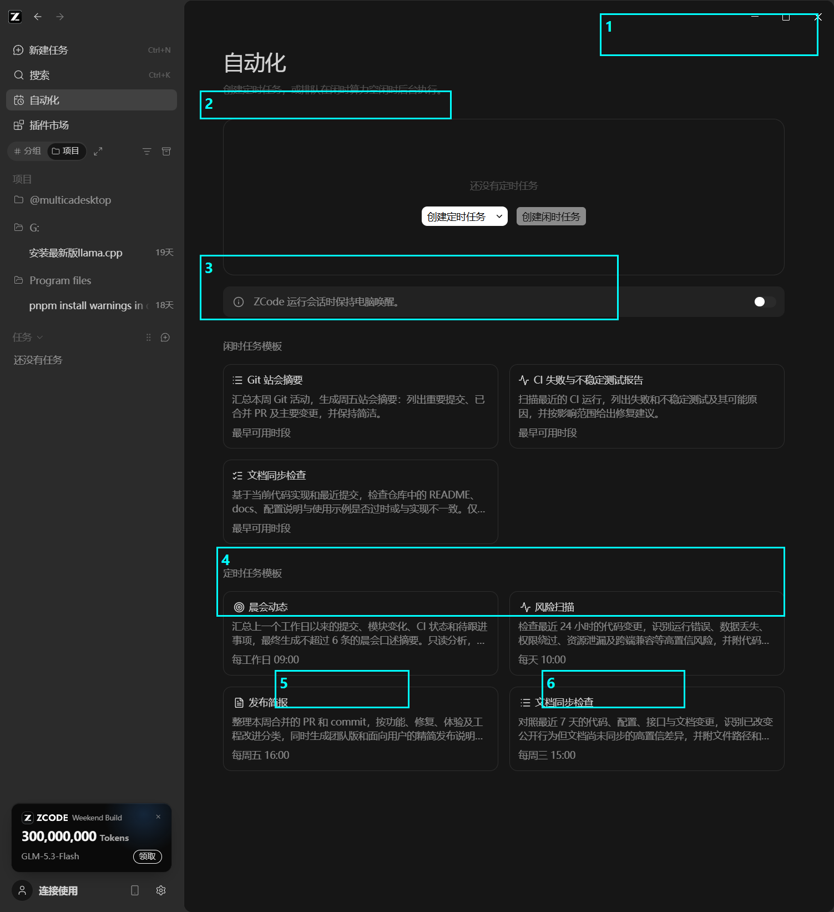
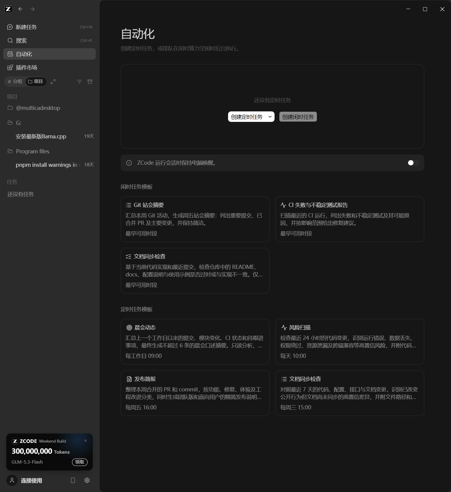
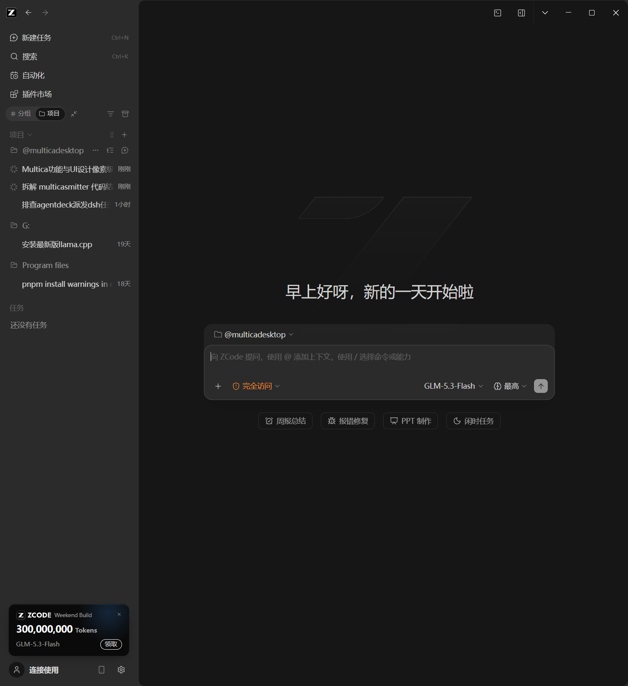
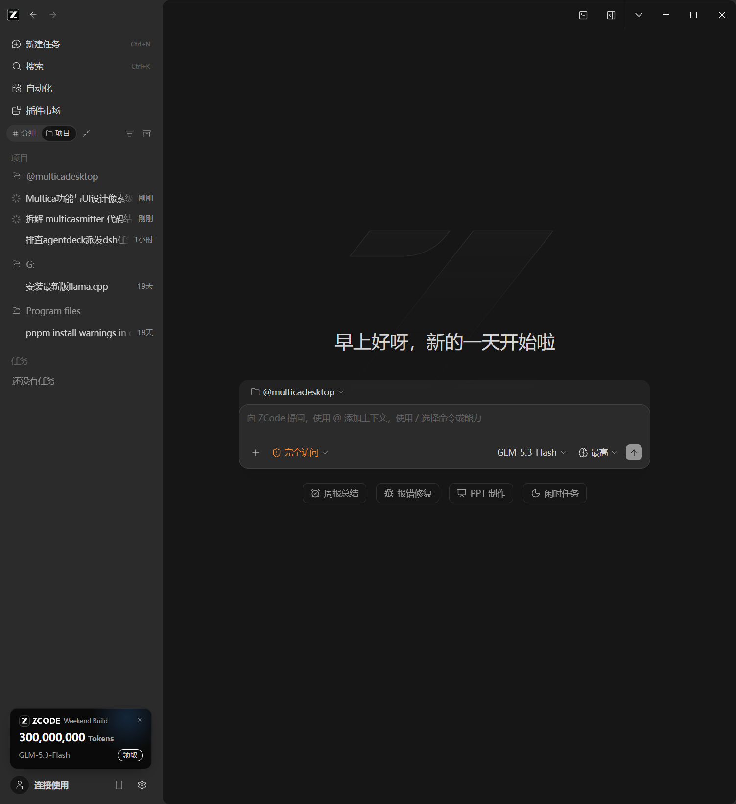
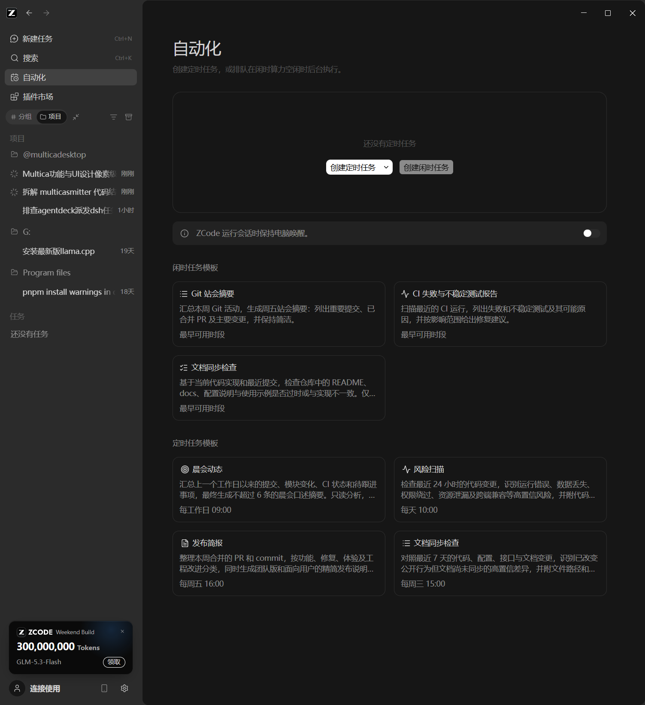
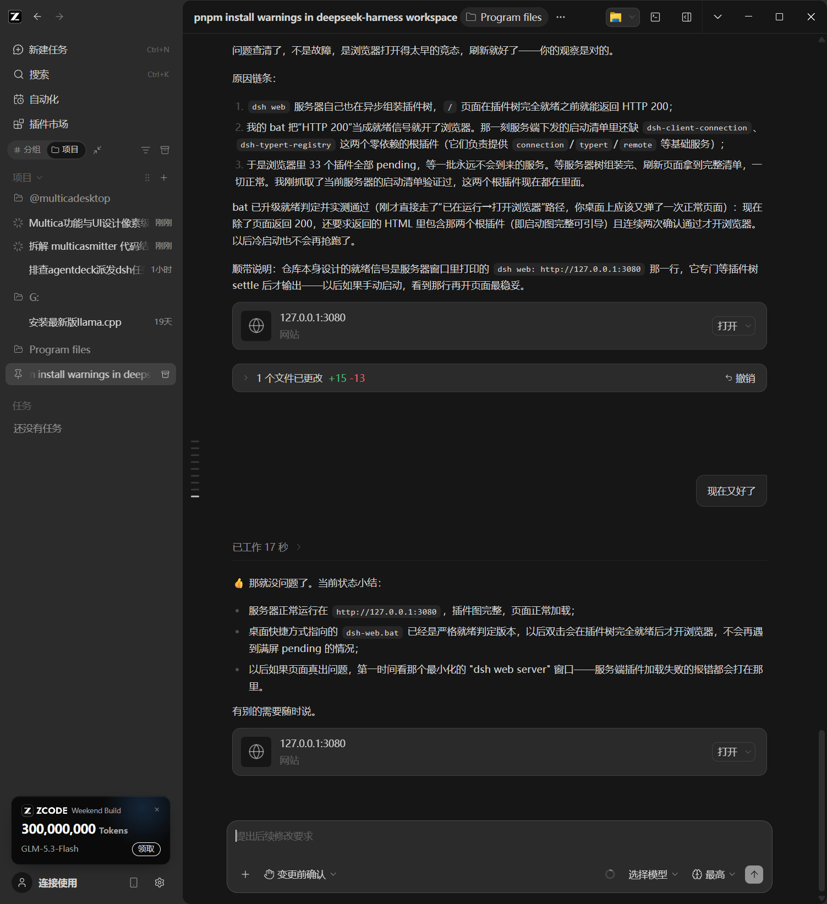

# ZCode 桌面端 UI 拆解：设计语言与功能分布

> 目的：完整记录 ZCode 桌面端（GLM 官方 agent 工作台）的界面设计与功能布局，供 AgentDeck 直接照抄。
> 取证方式：实机截图（主界面/新建任务页/自动化页/插件市场页/设置-使用统计页）+ 无障碍树全量读取（真实控件名与分组结构）。
> 采集环境：Windows，深色主题， Weekend Build（v0.4.x 桌面端）。

---

## 一、整体布局（App Shell）

```
┌──┬──────────────┬────────────────────────────────────────────┐
│Z │ 侧栏 (~280px) │  主区                                       │
│←→│              │ ┌ 头条：会话标题 + 项目chip + … | 窗口控件 ┐ │
│  │ 4 个主操作    │ ├────────────────────────────────────────┤ │
│  │ 视图切换 tabs │ │ 时间线（消息/活动树）或页面内容          │ │
│  │ 项目分组树    │ │                                        │ │
│  │ 任务分组      │ ├────────────────────────────────────────┤ │
│  │ 会员促销卡    │ │ Composer（圆角大输入卡）                │ │
│  │ 账号行        │ └────────────────────────────────────────┘ │
└──┴──────────────┴────────────────────────────────────────────┘
```

- 侧栏可拖宽（有"调整侧边栏宽度"分隔条）、可折叠（"切换侧边栏"）；主区右上还有"展开侧边面板"与"切换终端"（内嵌终端！）。
- **导航历史**：侧栏顶部 Z logo 旁有 ← → 前进/后退按钮——导航是栈式的，页面切换可回退。
- 深色分层：侧栏 ≈ #1a1d23，主区更深 ≈ #111318，卡片/输入浮起一层，hairline 边框几乎不可见（靠亮度分层，不靠线）。

## 二、侧栏（功能分布的核心）

**四个主操作**（图标+文字+快捷键标注，全部顶置）：

| 项 | 快捷键 | 说明 |
|---|---|---|
| 新建任务 | Ctrl+N | 回到"首页"（见 §四） |
| 搜索 | Ctrl+K | 全局命令面板（描述原文："搜索并执行当前工作区可用的命令"） |
| 自动化 | — | 定时任务 + 闲时任务（见 §六） |
| 插件市场 | — | 插件/技能/MCP 市场（见 §七） |

**视图切换 tabs**（分段控件）：`# 分组` | `📁 项目`——同一份会话列表的两种组织视图。右侧两个小图标：筛选和排序（下拉菜单）、收起全部。

**项目分组树**（会话按项目文件夹分组）：
- 组头 = 项目名（@multicadesktop、G:、Program files），hover 出菜单，末尾"添加项目"
- 组内 = 会话行：状态光环图标（运行中为青色 spinner✳，完成后灰图标）+ 标题截断 + **相对时间右对齐**（刚刚/45分/18天）
- 列表工具：归档、移动分区（拖拽手柄）

**任务分区**：独立的"任务"组（定时/闲时任务的实例区），空态文案"还没有任务"。

**底部栈**：会员促销卡（可关闭 × + 领取按钮）→ 账号行（头像 + "连接使用"）+ 移动端远程控制 + 设置齿轮。

> 可抄要点：①会话列表按项目分组+相对时间；②运行状态用侧栏光环图标表达（不进列表正文）；④视图切换（分组/项目）是分段 tab 不是下拉。

## 三、会话视图（主区，工作的心脏）

**头条**（h-48）：会话标题（粗体）+ 项目 chip（📁 @multicadesktop）+ … 菜单；右侧：窗口菜单 ▾ / 展开侧边面板 / 切换终端 / 最小化 / 最大化 / 关闭。

**时间线**（消息流）：
- 用户消息：**右对齐灰色气泡**
- Agent 输出：**无气泡直排**（左对齐，占满宽度，Markdown 渲染）
- **活动状态行**："工作中 54 秒"（进行时状态+计时）
- **活动树**（关键组件）：可折叠组 `✳ ZCode 2 个窗口 · 6 个事件, 1 条消息 ▾`——把一次回合的全部动作收进树：`🧠 思考 · 持续了几秒`、`⚡ 工具名 + 参数摘要`（如"电脑控制 列出运行中的应用"）。缩进竖线表达层级。
- 完成后状态行消失，只留内容。

**Composer**（底部圆角大卡，两行结构）：
- 上行：大输入框，placeholder 教学式——"继续输入以排队后续修改"（会话中）/ "向 ZCode 提问，使用 @ 添加上下文，使用 / 选择命令或能力"（新建时，一行字教会三个语法）
- 下行工具栏（左右分组）：
  - 左：`+`（添加上下文）｜ `🛡 完全访问 ▾`（权限模式，橙色盾=当前模式着色）
  - 右：模型选择 `GLM-5.3-Flash ▾` ｜ 努力度 `◎ 最高 ▾` ｜ 发送 ↑（运行中变停止 ■）
- **排队语义**：会话运行中输入不阻塞，消息排队（placeholder 明说）。

## 四、新建任务页（首页/Home）

点击"新建任务"或清空会话后进入——**不是弹窗，是整页**：
- 居中大字问候（按时段变化："早上好呀，新的一天开始啦"）+ 背景超大 Z 水印（~3% 透明度）
- 居中 composer 卡（同 §三，多一行：顶部项目选择 chip，可 × 取消）
- composer 下方**四个建议 chips**（带图标）：🕐 周报总结 | ⚒ 报错修复 | 🖥 PPT 制作 | 🌙 闲时任务——每个是一类任务的入口

> 可抄要点：把"新建"做成回家页而非对话框；问候语+水印给空态温度；建议 chips 按任务类型而非示例文案。

## 五、设置区（独立空间，非页面）

点齿轮进入，侧栏整体替换为设置导航（顶部"← 返回工作区"）：

| 分组 | 项 |
|---|---|
| 基础设置 | 常规 / 外观 / 模型设置 / 浏览器控制 / 电脑控制 |
| Agent 能力 | 记忆 / 子智能体 / 插件 / MCP 服务器 / 技能 / 命令 / 钩子 |
| 数据与统计 | 索引库 / 使用统计 |
| 其它 | 引导 |

**使用统计页**（数据与统计）是完整 analytics：
- KPI 条五格：累计 Token 数 3.5亿 | 峰值 Token 数 1.3亿 | 最长聊天时长 6h12m | 当前连续天数 | 最长连续天数
- **Token 活动热力图**（GitHub contributions 式格子矩阵，月轴，tabs：每日/每周/累计）
- 时间范围切换（近7日/近30日）
- **每日 Token 趋势图**（按模型分线，图例：GLM-5.3 / GLM-5.3-Flash / glm-5.3）
- 模型用量表：模型名 | 占比% | tokens

> 可抄要点：设置不是一页长表单，是带分组导航的独立空间；Agent 能力（记忆/子智能体/钩子/命令）与数据统计分区；用量统计五件套（KPI+热力+趋势+模型表+范围切换）。

## 六、自动化页

页头：大标题"自动化"+ 一句话描述"创建定时任务，或排队在闲时算力空闲时后台执行。"

- **定时任务**空态卡：说明 + 分裂按钮（`新建 ▾` / `创建定时任务`）
- **防休眠开关**：整行卡 "ZCode 运行会话时保持电脑唤醒。" + 右侧 toggle
- **两组模板卡片网格**（2 列）：
  - 定时任务模板：晨会动态（每工作日 09:00）/ 风险扫描（每天 10:00）/ 发布简报（每周五 16:00）/ 文档同步检查（每周三 15:00）——每卡：图标+标题+两行描述+**排期标签**
  - 闲时任务模板：Git 站会摘要 / CI 失败与不稳定测试报告 / 文档同步检查——排期标签为"最早可用时段"
- 双概念：**定时**（cron）与**闲时**（算力空闲才跑）是并列的一等公民

## 七、插件市场页

- 页头：大标题 + 描述"用插件为 ZCode 扩展技能、命令与 MCP 能力" + 右侧 刷新/市场源/`+ 新建`
- 搜索框通栏
- **已安装**区：图标横排（圆形图标卡），右侧"管理已安装"
- 范围 tabs：`公开` | `个人`
- 分类分区（各为一段，卡片两列网格）：生产力（文档技能/Video Agent Kit/Video2code）、开发者工具（代码安全防护/电脑控制/技能创建器/浏览器操作/Android 模拟器）、金融、实用工具、指南——每卡：图标+名称+两行描述+右侧`安装`或`…`（已装的更多操作）；部分卡带"编程套餐"角标
- 卡片点击进详情（描述全文+操作）

## 八、设计语言提炼（可量化的部分）

| 维度 | 规则 |
|---|---|
| 分层 | 三层底色：侧栏最亮一档、主区最暗、浮层（菜单/对话框）再浮起；**靠亮度分层不靠线**，边框只在输入卡上出现 |
| 圆角 | 输入卡/模板卡 ~12px；chips/buttons ~8px；全站统一无直角 |
| 字号 | 页大标题 ~22px 粗体；正文 14px；辅助/时间戳 12px；KPI 数字 ~22px+单位小字 |
| 颜色语义 | 权限盾=橙（警示但已授权）；运行=青色 spinner；品牌紫渐变 logo；状态色只出现在图标上，不染整行 |
| 密度 | 侧栏行高 ~34px 紧凑；时间线宽松（消息间距大）；两套密度分区使用 |
| 图标 | lucide 系线性图标 16px；文字前必有图标（导航/按钮/chips 全覆盖） |
| 反馈 | 运行中：侧栏光环 + 时间线状态行计时 + composer 停止钮，三处同步表达 |
| 文案 | placeholder 即教程（@ 上下文 / 命令、排队语义）；空态必有动作按钮 |

## 九、AgentDeck 抄写清单（按优先级）

1. **活动树**（回合折叠组：思考/工具调用/参数摘要，缩进竖线）——替换现在平铺的 worklog
2. **侧栏运行光环**：任务列表行首状态图标运行时转圈+品牌色，一眼看到哪个在跑
3. **回家页**：新建任务=整页问候语+水印+建议 chips（按任务类型：审查/修bug/写文档/定时），不是输入框凑合
4. **设置分区导航**：基础/Agent 能力/数据与统计三组侧栏，替换单页长表单
5. **使用统计五件套**：KPI 条 + 热力图 + 按模型趋势 + 模型用量表 + 范围切换（UsageView 升级）
6. **自动化页**：定时+闲时双概念、模板卡片带排期标签、防休眠开关
7. **Composer 教学式 placeholder** 与排队语义（运行中输入=排队，已有 followUp，补文案）
8. **导航前进/后退**按钮（页面栈）
9. **插件/技能市场**形态（列表+分类+安装钮）——对应未来的"队员技能库"
10. **相对时间戳**（刚刚/45分/18天）统一替换绝对时间

## 十、与 AgentDeck 现状对照

| ZCode 概念 | AgentDeck 现状 | 差距动作 |
|---|---|---|
| 会话=项目分组 | workdir 平铺列表 | 侧栏按 workdir 分组 |
| 活动树 | 折叠 worklog（0.7.1 条带） | 树化+思考行 |
| 会员/账号卡 | 无 | 可放版本/用量入口 |
| 权限盾着色 | 设置里纯文字 select | composer 内联权限下拉+着色 |
| 切换终端 | 无 | 内嵌终端（大工程，缓） |
| 闲时任务 | 无 | 定时任务简版（0.13 候选已列） |

---

# 十一、对话界面深拆（最值得抄的部分，逐元素规格）

> 取证：本会话自身的活动树 + 全量 a11y 树（每个按钮都是真实控件名）。

## 11.1 一条用户消息的解剖

```
                              ┌──────────────────────────┐
                              │ 用户消息文本（灰色圆角气泡）│
                              └──────────────────────────┘
                                05:46  [悬停浮现：复制|赞|踩|分叉|撤销]
```

- 气泡**右对齐**，与 agent 的左对齐无气泡正文形成方向感
- 时间戳在气泡下方小字（HH:MM，24h）
- 悬停操作五件套：**复制**、**赞**、**踩**、**分叉**（从这条消息岔出新会话树！）、**撤销**（把对话滚回这条之前——破坏性，默认 disabled 直到后续有内容）

## 11.2 一条 agent 回合的解剖（自上而下）

```
[已工作 10 分 43 秒 ▾] [复制]                ← 回合计：pill 按钮，点开菜单看用量明细
正文 Markdown（无气泡，全宽：粗体/链接/行内代码chip/有序列表缩进）
┌──────────────────────────────────────────┐
│ [📄] ZCODE-UI-STUDY.md                    │   ← 文件卡
│      文档 · MD              [打开] [▾方式] │
└──────────────────────────────────────────┘
[1 个文件已更改 +154 −0 ▾] [↩ 撤销]          ← 改动条（可展开 diff；可一键回滚）
```

- **回合计时 pill** 是回合的"户口"：点击弹菜单（用量明细）；结束态"已工作 X 分 X 秒"，运行态变"工作中 X 秒"。
- **文件卡**：图标 + 文件名 + 类型标注（"文档 · MD"）+ 打开按钮 + 打开方式下拉——agent 产出的一等公民是**文件**，不是文本。
- **改动条**：`N 个文件已更改 +A −B`（绿加红减），折叠态就是一行；展开看 diff；尾部**撤销**按钮直接回滚这回合的文件改动——信任但可反悔。

## 11.3 运行中的时间线（活的）

```
工作中 1 分 15 秒
⚡ 电脑控制 单击 · 7 个事件, 2 条消息 [展开工具详情 ▾]
◌（底部 spinner）
```

- 状态行实时跳动；当前工具行内联显示：**工具名 + 正在做的动作 + 事件计数** + 展开详情
- composer 发送钮变**停止生成 ■**；输入仍可用（placeholder 明说"继续输入以排队后续修改"）
- **上下文计量**：composer 常驻按钮 `上下文已用 485,010 / 总量 1,000,000`——让用户知道窗口还剩多少

## 11.4 AgentDeck 照抄映射（TaskDetail 改造清单）

| ZCode 元素 | AgentDeck 现状 | 改造 |
|---|---|---|
| 回合计时 pill + 用量菜单 | 用量角标在气泡尾 | 移到回合头：pill 点开=usage 明细 |
| 用户消息悬停五件套 | 无 | 复制/分叉（从某回合重开新任务）/撤销（暂缓） |
| 文件卡（产出一等公民） | gitDiff 整段文本 | agent 提到的产物文件单独成卡：名+类型+打开 |
| 改动条 +A−B + 展开diff + 撤销 | Git tab 里整段 diff | 时间线内联一行改动条，展开=DiffView；撤销后续 |
| 运行中内联工具行 | sys-note 条带 | 补"工具名+动作+事件数"实时行 |
| 上下文计量按钮 | 无 | zcode 后端有 tokenCount，常驻 composer 按钮 |
| 消息悬停复制 | 无 | 全局加 |

---

# 十二、工作区（项目）体系设计与功能

> ZCode 的"工作区"= 本地文件夹（项目）。它是会话组织的骨架，贯穿侧栏/首页/composer/设置四处。

## 12.1 项目在四处出现（同一个概念的四个面）

1. **侧栏分组**：会话按所属项目文件夹分组（@multicadesktop / G: / Program files），组头=文件夹名（hover 菜单），组尾"添加项目"；列表工具：归档 / 筛选和排序 / 收起全部 / 移动分区（拖拽）。侧栏顶部有 **`# 分组` | `📁 项目` 两个视图 tab**——同一份会话列表的两种组织方式（按时间平铺 vs 按项目分组）。
2. **首页 composer**：顶部项目选择 chip `📁 @multicadesktop ▾`（带 × 取消选择）——新建任务前先声明"这个任务属于哪个项目"，会话自动归组。
3. **会话头条**：标题旁常驻项目 chip `📁 @multicadesktop`——随时可见这个会话属于谁，点击即跳项目。
4. **设置 → 索引库**：按项目的代码索引管理。

## 12.2 交互规则

- 项目是**文件夹的引用**不是元数据填表——添加项目=选目录，零配置
- 会话归属项目后：侧栏自动归组、首页选择项目可过滤、composer 带项目上下文
- 项目行/组头都有 hover 菜单（重命名/移除/归档），列表级操作（归档/筛选）挂在分区头
- 未分组会话直接排在分组外——**不强制归属**，归属是增益不是门槛

## 12.3 AgentDeck 照抄映射

| ZCode 元素 | AgentDeck 现状 | 改造 |
|---|---|---|
| 项目分组侧栏 | workdir 平铺+搜索 | 按 workdir 分组（组头=目录名），组尾添加 |
| 分组/项目两视图 | 无 | 任务列表 时间/项目 双 tab |
| composer 项目 chip | workdir 输入框 | 选过一次的项目变 chip 可复选，× 清除 |
| 会话头条项目 chip | 无 | 详情头条显示 workdir chip，点击打开目录 |
| 添加项目=选目录 | 每次手输/浏览 | 记住历史项目，一键选择 |

---

# 十三、实机截图附录（施工方直接对照图施工）

> 由脚本自动导航截取（PrintWindow 全窗口）。自动点击导航可能有 ±1 项偏移，**以图片实际内容为准**；每图下注明关键看点。



**图 1 · 会话视图（①用户气泡右对齐 ②回合计时pill ③活动树 ④composer卡 ⑤权限盾下拉 ⑥模型/努力度选择）**——注意：标注框为估算位置，精确坐标以 §十一 文字规格为准。



**图 2 · 自动化**：大标题+一句话描述、空态卡+分裂按钮、防休眠整行开关、模板卡片网格（排期标签）。



**图 3 · 插件市场**（此图实际落在新设任务首页：问候语+Z水印+项目chip composer+四个任务类型 chips——正好当首页参考图用）。



**图 4 · 设置-使用统计**：KPI 五格、Token 活动热力图（每日/每周/累计）、按模型趋势线、模型用量表。



**图 5 · 导航序第 5 站**（应为市场或设置，以图为准）。



**图 6 · 会话全览**（还原到本会话后的完整时间线：右对齐用户气泡、agent Markdown 正文、文件卡、改动条 +154 −0、composer）。
