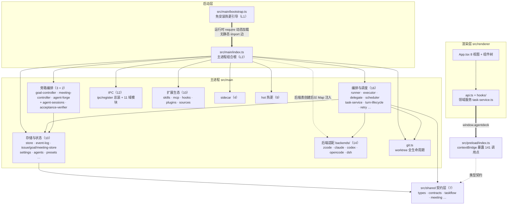
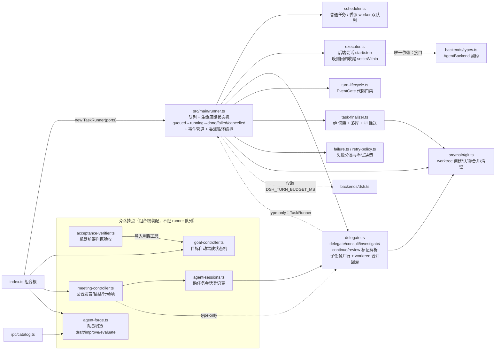
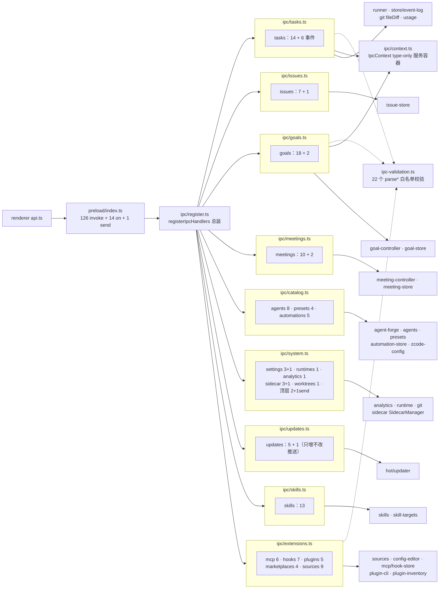
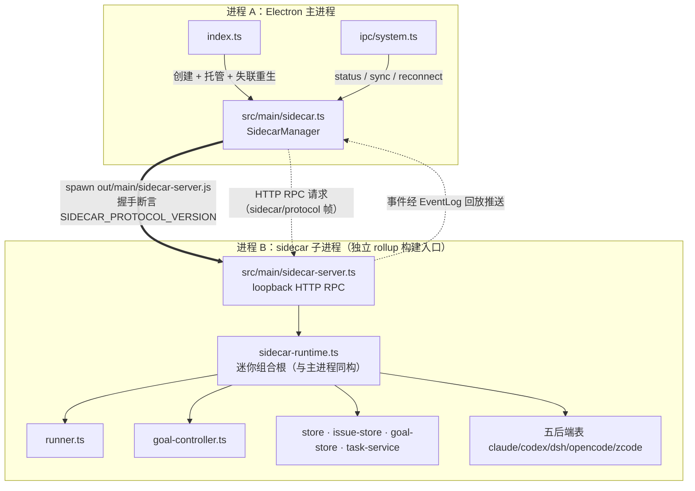
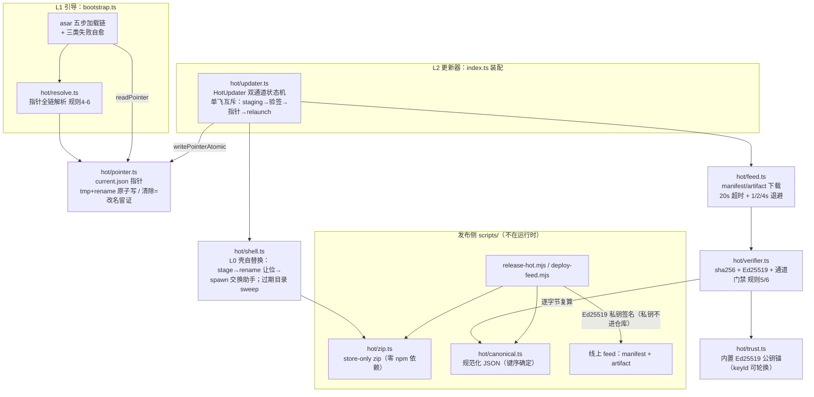
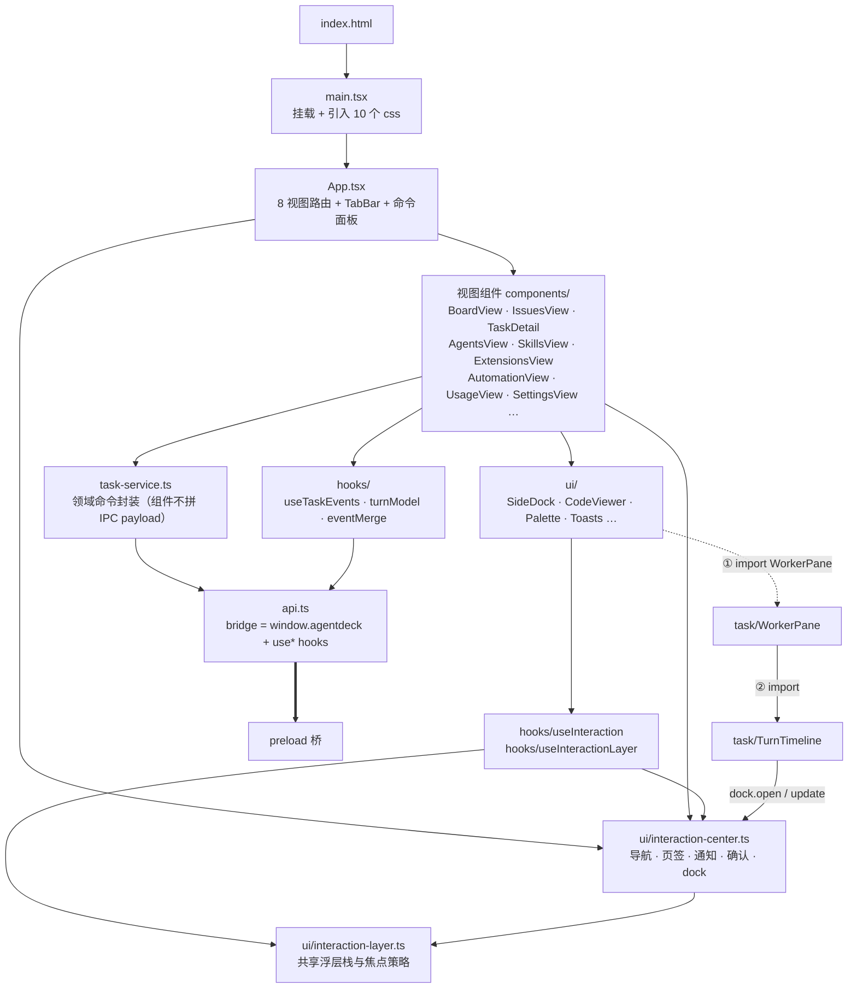

# AgentDeck 架构图谱（人读主图）

> 从 [`INVENTORY.md`](./INVENTORY.md)（原始盘点）提炼的手绘式导读图谱。数据基线：commit `6b2f038`（0.22.0-hot.19 后的 main 侧最新提交），主检出当时的 WIP（7 个已修改文件 + 未跟踪 `src/main/prompts/`）**不含在内**——见 [`README.md`](./README.md) 的「WIP 后处理清单」。
>
> 机读全量图（143 模块 / 292 条已解析依赖边）在 [`deps.mmd`](./deps.mmd) / [`deps.json`](./deps.json)；再生成命令见 README。本文 6 张图是那份数据的**可读投影**，节点数刻意裁剪到每组/每域一层。

## 图例（节点 / 边约定）

下文所有 Mermaid 图共用这套约定（由 INVENTORY 末尾「知识图谱生成素材约定」精炼而来）：

| 图元 | 含义 |
| --- | --- |
| 实线箭头 `-->` | 静态 `import`（运行时真实存在的值依赖） |
| 虚线箭头 `-.->` | 非运行时依赖：type-only 导入（编译期擦除）、进程/HTTP 关系、发布脚本关系 |
| 粗箭头 `==>` | 跨层强边：动态 `require` 或进程 spawn |
| 分组框 `subgraph` | 目录组 / **进程边界** / 发布侧与运行侧 |
| 节点标签第一行 | 仓库相对路径（可作 `deps.json` 里 `modules[].source` 的检索键） |

> INVENTORY 建议的全量图谱还有四类本文未画的节点：`symbol`（如 `src/main/runner.ts#TaskRunner`）、`ipc-domain`（20 个域，本文第 3 图按 handler 分组呈现）、`npm-script`（65 个）、`doc`（32 篇）；以及关键边 `bundles`（smoke 脚本 esbuild 直连 src——区分死代码与测试面的依据，见 INVENTORY 附录 A）。

---

## 1. 四层总览：bootstrap → main → preload → renderer

**人话导读**

- Electron 三层分工：主进程干所有活（编排/存储/子进程/热更），preload 只做类型安全桥，renderer 是纯视图——渲染层**永不**直接 import 主进程模块，一切走 `window.agentdeck`。
- `bootstrap.ts` 与 `index.ts` 之间没有静态边：`package.json` 的 main 指向 bootstrap 编译产物，它按热更指针运行时 require 内置或热更版 index。**机读图里 index「无入边」不是死文件**（同理 `sidecar-server.ts` 是被 spawn 的独立构建入口）。
- `src/shared` 是唯一被主进程与渲染层共同引用的契约层；改 shared 类型要同时看两层的编译。
- 五个后端适配器不进编排代码：组合根建好 `Map<string, AgentBackend>` 注入，`runner` 对具体后端的唯一引用是 dsh 的预算常量。

---

## 2. 编排主干链：runner → executor → delegate → git

**人话导读**

- 主干三层：**队列（runner）→ 回合（executor）→ 委派（delegate）**。executor 只认 `AgentBackend` 接口，换/加后端不动编排；delegate 把「派子任务给别的 agent」做成文本协议标记，子任务落在独立 worktree 跑完再由 git 合并回灌。
- `delegate → runner` 只有 `import type`（编译期擦除），运行时**无环**（INVENTORY §2.6 环 1）；想彻底消环可把 `RunnerPorts` 的委派端口收窄成接口移进 delegate。
- `EventGate`（turn-lifecycle）是可靠性闸门：stop/close 之后晚到的后端回调按代际作废，不会污染下一个回合。
- goal / meeting / forge 三个旁路**不走 runner 的队列**，由组合根直接装配；meeting 与 agent-sessions 复用 delegate 的协议解析（type-only + 值导入各一）。
- git.ts 在主干上出现三次：委派回灌、任务终态快照、IPC 的 fileDiff——它是唯一碰 git 的模块。

---

## 3. IPC 域地图：20 个域 → 9 个 handler 模块 → 主进程服务

**人话导读**

- 141 个调用点收敛到一个 `contextBridge`；域 → handler 的映射是**九对多**：9 个 register 模块承接 20 个域，`ipc/register.ts` 一处总装。
- 两个横切层：所有入参先过 `ipc-validation` 的 parse\* 白名单；所有服务定位经 `IpcContext`（type-only 容器，依赖倒置中枢——主进程模块对 IPC 层零反向依赖）。
- `catalog` 是「身份与连接」复合域：agents/presets/automations 三类 CRUD **加**锻造师 draft/improve/evaluate——锻造师唯一的 IPC 出口在这里。
- `extensions` 承载五类扩展资产域（mcp/hooks/plugins/marketplaces/sources），是落点模块最多的 handler。
- `sidecar:status` 事件不经 system handler：由 `index.ts` 在状态屏障完成后直推渲染层；`updates:state` 遵守「只增不改」推送约定。

---

## 4. sidecar 双腿进程图

**人话导读**

- 「双腿」是**进程级**的：主进程腿（`SidecarManager`）只管 spawn、握手、RPC 调用与失联重生；执行腿在子进程里由 `sidecar-runtime` 自举——复用与主进程**同一批**编排/存储模块，但所有活对象（Store、runner、后端表）都是子进程自己的。
- 两侧唯一合约是 `sidecar/protocol.ts`（协议版本 + 请求/响应/错误帧），因此子进程可以独立构建、独立热更。
- 事件不直传：子进程写 EventLog，Manager 侧按回放推送主进程，避免自定义流式协议。
- 命名陷阱（已于本轮处理）：真身是 `src/main/sidecar.ts` 与 `src/main/sidecar-server.ts`；目录 `src/main/sidecar/` 下曾有的 manager/server/index 三个再导出垫片因零引用已删除，目录仅存协议文件 `protocol.ts`。

---

## 5. hot 热更链路：发布 → 引导（L1）→ 更新器（L2）

**人话导读**

- 三方分工：**发布脚本**造载荷并签名；**bootstrap（L1）**决定「本次启动跑哪个版本」；**HotUpdater（L2）**决定「下一个版本怎么来」。L1 与 L2 共用 `hot/resolve` + `hot/pointer`，规则只有一份。
- 信任只有两种来源：sha256 完整性 + Ed25519 签名；`canonical.ts` 保证发布侧序列化与校验侧重算逐字节一致——这是签名可验的前提。
- 一切状态推进走 `writePointerAtomic` 单窄门（tmp+rename），天然抗中断；「更新」= 改指针，「回滚」= 改回指针，「清除」= 改名留证。
- Windows 的运行中 exe 不可覆盖，所以 L0 壳自替换是文件级 rename dance（stage 解压 → 旧文件 `.old-ts` 让位 → 外部交换助手进程完成换血），失败可回滚。

---

## 6. renderer 分层：视图 → 领域服务 → 桥

**人话导读**

- 渲染层是单向漏斗：**视图 → task-service（领域命令）→ api.ts → preload 桥**；组件只传领域值，不碰 IPC payload 细节。
- 2026-09-20 UI 统一改造已解开 `SideDock → WorkerPane → TurnTimeline → SideDock` 旧循环。`TurnTimeline` 直接调用不依赖视图的 `interaction-center`；页面与宿主通过中心共享状态，业务执行继续调用 `task-service`。
- `npm run smoke:ui` 覆盖交互中心和真实 React DOM 的焦点回归，并纳入 `smoke:all`。新增的直接消费导出同属测试面公共 API。
- `hooks/turnModel` 被 `npm run smoke:turn-model` 经 esbuild **直连消费**——渲染层也有测试面 API，不能当死代码删（INVENTORY 附录 A）。
- 样式按 `styles.css / tokens.css + polish/ 8 分区`组织，改动视觉先看 tokens。
