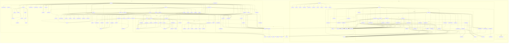

# 全量依赖图（mermaid 壳）

> 由 `npm run graph:view` 从 `deps.mmd` 包装生成。节点数已接近 GitHub 页内 mermaid 的渲染上限，
> 页内渲染失败时改用 `npm run graph:view` 看 3D 星图或平面交互版。

```mermaid
flowchart LR

subgraph 0["src"]
subgraph 1["main"]
2["acceptance-verifier.ts"]
3["agent-exchange.ts"]
4["skills.ts"]
5["agent-forge.ts"]
8["agents.ts"]
subgraph A["prompts"]
B["personas.ts"]
C["forge.ts"]
15["index.ts"]
16["delegation.ts"]
17["goal.ts"]
18["handoff.ts"]
19["meeting.ts"]
end
D["agent-sessions.ts"]
E["analytics.ts"]
F["automation-store.ts"]
subgraph G["backends"]
H["claude.ts"]
I["cli-common.ts"]
J["cli-locator.ts"]
K["edit-meta.ts"]
L["codex.ts"]
M["dsh-acp.ts"]
N["dsh.ts"]
O["opencode-server.ts"]
P["opencode.ts"]
Q["types.ts"]
R["zcode-config.ts"]
S["zcode-protocol.ts"]
T["zcode-transport.ts"]
U["zcode.ts"]
end
V["bootstrap.ts"]
subgraph W["hot"]
X["pointer.ts"]
Y["resolve.ts"]
Z["verifier.ts"]
10["canonical.ts"]
11["trust.ts"]
1J["feed.ts"]
1K["shell.ts"]
1L["zip.ts"]
1M["updater.ts"]
end
12["config-editor.ts"]
13["delegate.ts"]
14["git.ts"]
1A["event-log.ts"]
1B["executor.ts"]
1C["extension-catalog.ts"]
1D["failure.ts"]
1E["goal-controller.ts"]
1H["goal-store.ts"]
1I["hook-store.ts"]
1N["index.ts"]
subgraph 1O["ipc"]
1P["register.ts"]
1Q["catalog.ts"]
1T["extensions.ts"]
1Y["goals.ts"]
1Z["issues.ts"]
20["meetings.ts"]
21["skills.ts"]
23["system.ts"]
25["tasks.ts"]
27["updates.ts"]
2M["context.ts"]
end
1R["ipc-validation.ts"]
1S["presets.ts"]
1U["mcp-store.ts"]
1V["plugin-cli.ts"]
1W["plugin-inventory.ts"]
1X["sources.ts"]
22["skill-targets.ts"]
24["runtime.ts"]
26["usage.ts"]
28["issue-store.ts"]
29["meeting-controller.ts"]
2A["meeting-store.ts"]
2B["retention.ts"]
2C["runner.ts"]
2D["permission-broker.ts"]
2E["retry-policy.ts"]
2F["scheduler.ts"]
2G["task-finalizer.ts"]
2H["turn-lifecycle.ts"]
2I["settings.ts"]
2J["sidecar.ts"]
2K["store.ts"]
2L["task-service.ts"]
2N["sidecar-runtime.ts"]
2O["sidecar-server.ts"]
subgraph 2P["sidecar"]
2Q["protocol.ts"]
end
end
subgraph 6["shared"]
7["forge.ts"]
9["types.ts"]
1F["taskflow.ts"]
1G["meeting.ts"]
4P["contracts.ts"]
4Q["extensions.ts"]
4R["skills.ts"]
end
subgraph 2R["preload"]
2S["index.ts"]
end
subgraph 2T["renderer"]
subgraph 2U["out"]
subgraph 2V["renderer"]
subgraph 2W["assets"]
2X["index-DHUaLCg5.js"]
end
end
end
subgraph 2Y["src"]
2Z["App.tsx"]
30["api.ts"]
subgraph 31["components"]
32["AgentsView.tsx"]
36["AutomationView.tsx"]
37["BoardView.tsx"]
3C["ExtensionsView.tsx"]
3E["SkillsView.tsx"]
3F["IssuesView.tsx"]
3G["SettingsView.tsx"]
3H["RuntimeView.tsx"]
3I["UpdatePanel.tsx"]
3J["TabBar.tsx"]
3K["TaskDetail.tsx"]
subgraph 3S["task"]
3T["WorkerPane.tsx"]
3U["TurnTimeline.tsx"]
45["ActivityTimeline.tsx"]
46["GitSummary.tsx"]
48["PermissionPrompt.tsx"]
49["SkillMenu.tsx"]
end
3V["Markdown.tsx"]
subgraph 3X["goal"]
3Y["GoalPanel.tsx"]
40["GoalCreateDialog.tsx"]
end
subgraph 41["meeting"]
42["MeetingCard.tsx"]
43["MeetingPanel.tsx"]
44["captains.ts"]
end
47["DiffView.tsx"]
4A["UsageView.tsx"]
4B["WorkspaceView.tsx"]
end
subgraph 33["ui"]
34["Menu.tsx"]
35["Toasts.tsx"]
3A["EmptyState.tsx"]
3B["IssueIdChip.tsx"]
3D["Confirm.tsx"]
3R["SideDock.tsx"]
3W["CodeViewer.tsx"]
3Z["FloatWindow.tsx"]
4C["Palette.tsx"]
end
38["labels.ts"]
39["task-service.ts"]
subgraph 3L["hooks"]
3M["turnModel.ts"]
3N["useIssueDetails.ts"]
3O["usePromptHistory.ts"]
3P["useTaskEvents.ts"]
3Q["eventMerge.ts"]
end
4D["main.tsx"]
subgraph 4E["polish"]
4F["board.css"]
4G["detail.css"]
4H["dock.css"]
4I["foundation.css"]
4J["issue-home.css"]
4K["page-shell.css"]
4L["team.css"]
4M["usage.css"]
end
4N["styles.css"]
4O["tokens.css"]
end
end
end
3-->4
5-->7
5-->8
5-->C
5-->4
8-->7
8-->9
8-->B
C-->7
H-->I
H-->J
H-->K
L-->I
L-->J
L-->K
M-->I
M-->J
N-->I
N-->J
N-->M
O-->K
P-->I
P-->J
P-->K
P-->O
R-->I
S-->I
T-->I
U-->I
U-->K
U-->R
U-->S
U-->T
V-->X
V-->Y
Y-->X
Y-->Z
Z-->10
Z-->11
13-->14
13-->15
15-->16
15-->C
15-->17
15-->18
15-->19
15-->B
1A-->9
1E-->1F
1E-->17
1F-->1G
1H-->1F
1H-->9
1H-->1A
1I-->4
1K-->1L
1M-->1J
1M-->X
1M-->Y
1M-->1K
1M-->11
1M-->Z
1M-->1L
1N-->2
1N-->D
1N-->8
1N-->F
1N-->H
1N-->L
1N-->N
1N-->P
1N-->U
1N-->1A
1N-->14
1N-->1E
1N-->1H
1N-->X
1N-->Y
1N-->1K
1N-->1M
1N-->1P
1N-->28
1N-->29
1N-->2A
1N-->1S
1N-->2B
1N-->2C
1N-->2I
1N-->2J
1N-->4
1N-->2K
1N-->2L
1P-->1Q
1P-->1T
1P-->1Y
1P-->1Z
1P-->20
1P-->21
1P-->23
1P-->25
1P-->27
1Q-->7
1Q-->3
1Q-->5
1Q-->8
1Q-->R
1Q-->1R
1Q-->1S
1R-->9
1S-->9
1T-->12
1T-->1C
1T-->1I
1T-->1R
1T-->1U
1T-->1V
1T-->1W
1T-->4
1T-->1X
1U-->4
1V-->I
1V-->J
1W-->12
1W-->1X
1X-->12
1X-->4
1Y-->1R
1Z-->1R
20-->1R
21-->1R
21-->22
21-->4
22-->4
23-->E
23-->R
23-->14
23-->1R
23-->24
25-->1F
25-->14
25-->1R
25-->26
28-->1F
29-->19
2A-->1G
2C-->1F
2C-->N
2C-->13
2C-->1B
2C-->1D
2C-->14
2C-->2D
2C-->15
2C-->2E
2C-->2F
2C-->2G
2C-->2H
2G-->1F
2G-->14
2G-->26
2H-->1F
2I-->9
2K-->9
2K-->1A
2N-->9
2N-->H
2N-->L
2N-->N
2N-->P
2N-->U
2N-->1E
2N-->1H
2N-->28
2N-->2C
2N-->2K
2N-->2L
2O-->1A
2O-->2J
2O-->2N
2O-->2Q
2Q-->2J
2Z-->30
2Z-->32
2Z-->36
2Z-->37
2Z-->3C
2Z-->3F
2Z-->3G
2Z-->3J
2Z-->3K
2Z-->4A
2Z-->4B
2Z-->38
2Z-->39
2Z-->3D
2Z-->4C
2Z-->3R
2Z-->35
32-->7
32-->9
32-->30
32-->34
32-->35
36-->7
36-->9
36-->30
36-->35
37-->30
37-->38
37-->39
37-->3A
37-->3B
37-->35
39-->30
3B-->35
3C-->30
3C-->3D
3C-->3A
3C-->35
3C-->3E
3E-->30
3E-->3D
3E-->3A
3E-->35
3F-->30
3G-->30
3G-->3A
3G-->34
3G-->35
3G-->3H
3G-->3I
3H-->30
3I-->30
3I-->3A
3I-->35
3K-->30
3K-->3M
3K-->3N
3K-->3O
3K-->3P
3K-->38
3K-->39
3K-->3D
3K-->3B
3K-->3R
3K-->35
3K-->3Y
3K-->3V
3K-->42
3K-->43
3K-->45
3K-->46
3K-->48
3K-->49
3K-->3U
3N-->30
3P-->30
3P-->3Q
3R-->3T
3R-->3W
3T-->30
3T-->3M
3T-->3P
3T-->38
3T-->3U
3U-->30
3U-->3M
3U-->38
3U-->3R
3U-->3V
3Y-->30
3Y-->38
3Y-->3D
3Y-->3Z
3Y-->35
3Y-->40
40-->30
40-->34
40-->35
42-->30
43-->7
43-->30
43-->3Z
43-->35
43-->44
43-->42
45-->30
45-->3V
46-->47
4A-->30
4B-->7
4B-->30
4B-->35
4B-->44
4D-->2Z
4D-->4F
4D-->4G
4D-->4H
4D-->4I
4D-->4J
4D-->4K
4D-->4L
4D-->4M
4D-->4N
4D-->4O
```
